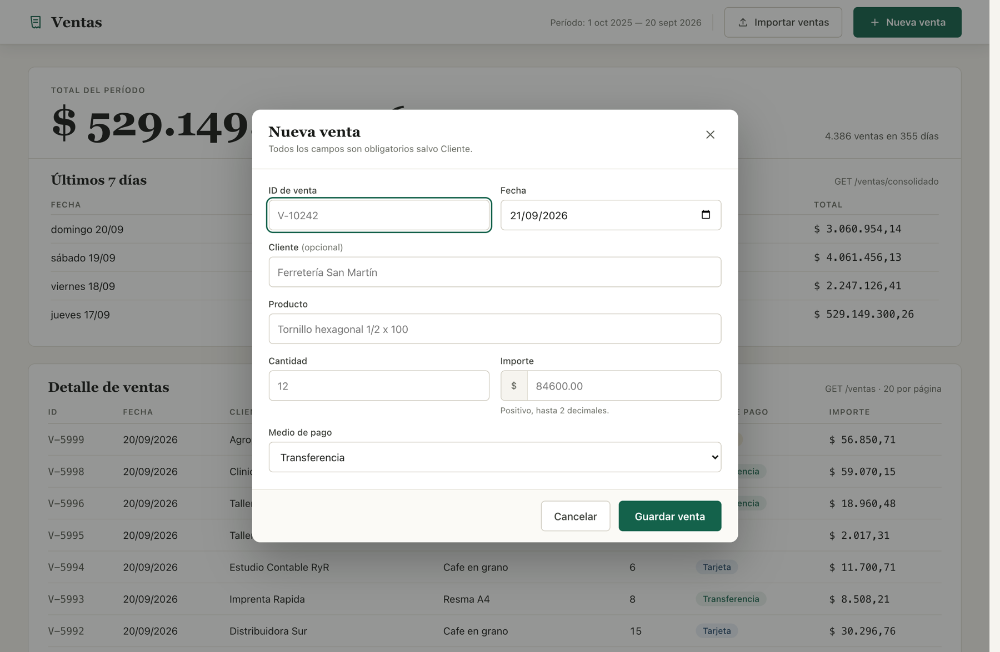
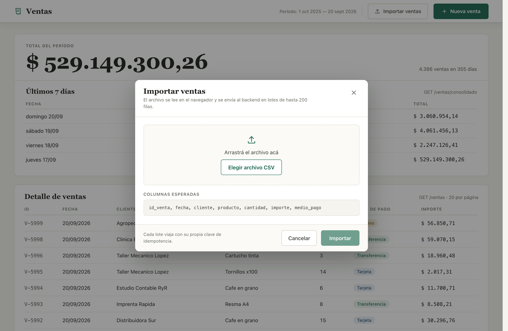
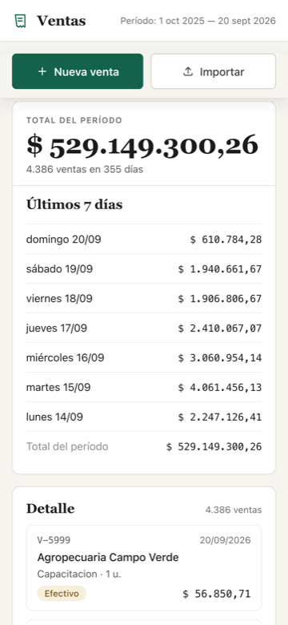

# Ventas — Business Case Colppy

Una pantalla para seguir las ventas del día a día y cargarlas, de a una
o subiendo un CSV. API en NestJS con PostgreSQL y Redis, front en React.


| Alta individual | Importación de CSV |
|---|---|
|  |  |

A 390 px el desglose y el detalle dejan de ser tablas: una fila por día,
una tarjeta por venta.



## Cómo correrlo

Hace falta Docker y Node 20 (está en `.nvmrc`; con `nvm use` alcanza).

```bash
# 1. Infra (Postgres + Redis), ya con datos de ejemplo
cp .env.example .env          # viene completo, no hay nada que editar
docker compose up -d --wait

# 2. Backend (puerto 3000)
cd backend
cp .env.example .env
npm install
npm run start:dev

# 3. Frontend (puerto 5173)
cd ../frontend
npm install
npm run dev
```

Los dos `.env.example` vienen completos y coordinados entre sí, así que
copiarlos alcanza. La base arranca sembrada con **4386 ventas sobre 355
días**: los scripts de `docker/init-db/` se ejecutan solos la primera
vez y cargan el CSV de ejemplo, para que la pantalla tenga datos desde
el primer arranque.

El front apunta a `http://localhost:3000`, fijo en
`frontend/src/api/httpClient.ts`. No hay `.env` de frontend a propósito:
es una pantalla que habla con un solo backend.

## Por qué este stack

**NestJS** porque la estructura que impone —guards, interceptors,
inyección de dependencias— es justo donde vive la idempotencia, que era
la parte más delicada del pedido. **PostgreSQL** porque `ON CONFLICT` y
`NUMERIC` resuelven en la base la deduplicación y la exactitud de la
plata, sin que la app tenga que ocuparse. **Redis** porque la
idempotencia por lote necesita un `SET NX` atómico con vencimiento, que
es su caso de uso de manual. **React** porque es la tecnología con la que
vengo trabajando hace tiempo.

## Endpoints

| Método | Ruta | Qué hace |
|---|---|---|
| `POST` | `/ventas` | Alta de una venta. `201` si se insertó, `200` si el `id` ya existía. |
| `GET` | `/ventas?page&limit` | Listado paginado, por fecha descendente. `limit` por defecto 20, tope 100. |
| `GET` | `/ventas/consolidado` | Total del período, cantidad de ventas y desglose por día. |
| `POST` | `/ventas/importar` | Alta masiva en lotes de hasta 200 filas. Pide `Idempotency-Key` por header. |

## Las decisiones que más importan

**La carga es idempotente en dos capas, porque son dos problemas
distintos.** Que no se duplique una *venta* lo resuelve
`INSERT ... ON CONFLICT (id) DO NOTHING` en la base: es atómico, no hay
hueco entre fijarse si existe y escribirla. Que no se reprocese un
*lote* entero si la request se reintenta lo resuelve un
`Idempotency-Key` obligatorio guardado en Redis con `SET NX`, que deja
pasar una sola de varias requests simultáneas y rebota el resto con
`409`.

**Sin ORM.** Una tabla y tres consultas que no son triviales. SQL
directo con `pg` evita una capa de indirección que acá no aporta, y deja
a la vista exactamente qué se ejecuta contra la base.

**El dinero es `NUMERIC`, no `float`.** Un `double` es más rápido pero
pierde precisión: sirve para coordenadas, no para plata.

**Las validaciones están en la base además de en el código.** Los
`CHECK` de `cantidad > 0` e `importe > 0` duplican lo que ya valida el
DTO. Es a propósito: la capa de aplicación se puede saltear con un
script o una migración, y la integridad del dato no debería depender
solo de eso.

**Una fila inválida no frena el lote.** Se separa con el motivo exacto
—en español, escrito en el propio DTO— y las válidas entran igual. El
mensaje del backend llega tal cual a la pantalla, sin reescribirse del
lado del cliente.

**Sin librería de componentes en el front.** SCSS propio con BEM y los
tokens centralizados en `frontend/src/styles/`. Una pantalla chica con
un sistema visual ya definido no justificaba traerse una dependencia de
diseño entera.

El detalle de cada una, con el razonamiento completo y las alternativas
que se descartaron, está en **[docs/DECISIONES.md](docs/DECISIONES.md)**.

## Qué prioricé

1. **Que la carga no duplique**, ni por fila ni por lote, ni siquiera
   con requests en paralelo.
2. **Que un fallo a mitad de camino se pueda reintentar** sin cargar dos
   veces lo mismo y sin quedar bloqueado.
3. **Que la pantalla no mienta**: skeletons en vez de ceros mientras
   carga, porque un cero es un dato; y un bloque caído que no tumba al
   otro.
4. **Tests sobre eso mismo**, no sobre lo que es fácil de testear.

## Cómo probar

- **Backend** — `npm test` desde `backend/`: 25 tests contra el Postgres
  y el Redis del compose. Cubren que no se dupliquen las ventas, que
  paginar no repita ni pierda filas, que el consolidado sume bien, y que
  de diez requests en paralelo con la misma clave pase una sola.
- **Frontend** — `npm test` desde `frontend/`: 33 tests sobre funciones
  puras (formato, parseo de CSV, armado de claves, errores de
  validación). No necesitan backend ni base.
- **Manual** — `pruebas/README.md` tiene 7 grupos de casos y 6 CSV
  pensados para forzar cada resultado posible de una importación,
  incluido cortar la red a mitad de un envío.

Los tests del backend corren contra infra real y no contra un `Pool`
simulado: con el pool mockeado, un test de idempotencia solo verifica
que se llamó a `pool.query` con cierto texto, no que la segunda
inserción efectivamente no duplique. Usan una base y un Redis aparte,
así que no tocan los datos de la app.

## Riesgo de performance

Con 4386 ventas no hay nada que optimizar: el listado responde en 0,1 ms
y el consolidado en 1,2 ms. Para saber dónde se rompe cargué **1 millón
de ventas** en una base aparte y medí con `EXPLAIN (ANALYZE, BUFFERS)`.

**El `OFFSET` del listado es el primer cuello, y crece lineal:**

| `OFFSET` | Tiempo |
|---|---|
| 0 | 6 ms |
| 50.000 | 34 ms |
| 500.000 | 246 ms |
| 999.980 | **495 ms** |

Postgres no puede saltar a la fila 999.980: lee y descarta todas las
anteriores. Devolver 20 filas le cuesta recorrer el millón.

La salida no es un índice, es cambiar de técnica: pedir "lo que sigue
después de esta fila" en vez de "saltá N filas". Medido en la misma
posición, **1,7 ms** — unas 290 veces más rápido, y constante en
cualquier página.

**El consolidado agrega sobre toda la tabla**, sin filtro: 49 ms con 1M
de filas contra 1,2 ms con 4386. Crece con el histórico y se pide en
cada carga. La primera medida sería aceptar un período; si aun así pesa,
es el caso de libro para una tabla de totales por día, porque el pasado
no cambia y recalcularlo entero cada vez es trabajo repetido.

**En producción lo mediría distinto**: `pg_stat_statements` para ver qué
consulta acumula más tiempo total —no la más lenta, la más lenta que
además corre seguido— y latencia por endpoint en p95 y p99, porque el
promedio esconde justo la cola que sufre el usuario.

El detalle completo, con los riesgos del frontend, está en
[docs/DECISIONES.md](docs/DECISIONES.md#riesgo-de-performance).

## Qué quedó afuera, y por qué

**Backend**

- **Autenticación.** No hay pantalla de login en el alcance. En un back
  office real esto iría detrás de JWT. No lo simulé con una API key
  fija: hubiera sido seguridad de juguete.
- **Tests end-to-end sobre HTTP.** La cobertura llega hasta el service y
  los guards, que es donde vive la lógica que se rompe en silencio. El
  recorrido por HTTP lo cubren la lista manual y dos scripts que pegan
  contra la API levantada.
- **Partir automáticamente un lote que supere el límite de parámetros de
  Postgres.** El tope de 200 en el DTO ya previene el problema, y
  trocear a mano traía complejidad real (reconciliar resultados entre
  sub-lotes, manejar un fallo parcial) sin un caso que lo pidiera.

**Frontend**

- Routing, login o roles en la UI.
- Editar o borrar ventas ya cargadas.
- Gráficos — el desglose por día es una tabla, que para comparar siete
  importes se lee más rápido y es más accesible.
- Manejo de estado global: alcanza con estado local en uno o dos
  componentes.
- Un botón de actualizar manual: el consolidado ya se refresca solo
  después de cada alta o importación, que son los únicos dos eventos que
  pueden cambiarlo. Sí quedó un botón de reintentar, pero en el estado
  de error de red, que es cuando volver a pedir sirve.

## Lo que sabemos que falta

- **`GET /ventas/consolidado` no acepta un período**: siempre agrega
  sobre toda la tabla. El período que muestra el header sale de las
  fechas que ya trae el propio consolidado; es informativo, no filtra.
- **El desglose muestra los últimos 7 días**, no el historial completo.
  Mostrarlo entero pide una vista propia, no un botón: con muchos días,
  dos columnas dejan de leerse como una semana.
- **Los modales en mobile** quedan como un cuadro centrado. Funciona,
  pero a 390 px lo esperable es pantalla completa.

Con más tiempo, lo primero sería el período en el consolidado: es el
parámetro que desbloquea el resto.

---

**Más detalle:** [docs/DECISIONES.md](docs/DECISIONES.md) ·
**Hooks del front:** [frontend/SERVICIOS.md](frontend/SERVICIOS.md) ·
**Casos manuales:** [pruebas/README.md](pruebas/README.md)
