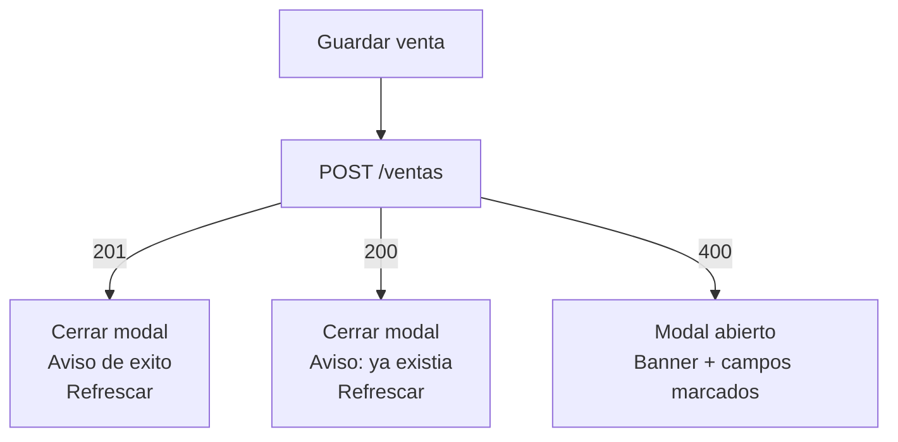
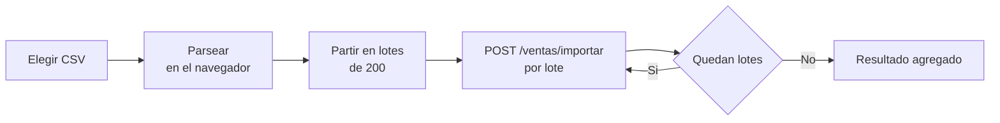

# Pantalla de Ventas — Guía de implementación frontend

2026-09-21 · @Miguel Angel Alvarez Urtiberea

## Qué se implementa

Una sola pantalla de back office de ventas para PyMEs, con dos cosas que tiene que resolver: entender de un vistazo cómo vienen las ventas, y cargarlas de a una o en lote por CSV. Sin routing, sin login, sin edición ni borrado.

La pantalla muestra dos bloques: el consolidado arriba y el detalle abajo. Las dos acciones de carga viven en el header y abren modales. El frontend consume solo el backend propio, nunca lee el CSV contra la base.

| Vista | Archivo exportado | Cuándo se ve |
| --- | --- | --- |
| Pantalla con datos | 01-pantalla-con-datos.html | Estado normal, hay ventas en la base |
| Pantalla sin ventas | 02-pantalla-sin-ventas.html | La base está vacía |
| Modal Nueva venta | 03-modal-nueva-venta.html | Click en Nueva venta |
| Modal Importar ventas | 04-modal-importar-ventas.html | Click en Importar ventas |
| Nueva venta con errores | 05-nueva-venta-validaciones.html | El backend respondió 400 |
| Importación en progreso | 06-importar-progreso.html | Mientras se envían los lotes |
| Importación terminada | 07-importar-resultado.html | Terminaron todos los lotes |
| Ancho angosto | 08-ancho-390.html | Viewport de 390 px |

Los anchos de referencia son 1440 px para desktop y 390 px para el angosto. El diseño no está optimizado para celular: alcanza con que no se rompa.

## Sistema visual

Neutros cálidos, un solo acento verde, y los colores de estado reservados para los tres resultados de una importación. Nada de gradientes ni de emojis.

### Color

| Token | Hex | Uso |
| --- | --- | --- |
| Fondo de página | #F6F4EF | Body y fondo detrás de las cards |
| Superficie | #FFFFFF | Cards, modal, inputs |
| Superficie sutil | #FBFAF6 | Zona de drop, footer del modal, bloque de código, estado vacío |
| Texto principal | #1A1C19 | Cuerpo, celdas, valores |
| Texto de label | #3B3E38 | Labels de campo, texto de botón secundario |
| Texto secundario | #55584F | Descripciones, columna de porcentaje |
| Texto terciario | #6A6D64 | Captions, encabezados de tabla, hints |
| Texto apagado | #8A8D83 | "Sin cliente", total en cero, elipsis de paginación |
| Borde de card | #E2DFD6 | Cards, modal, separadores, encabezado de tabla |
| Borde de fila | #EFEDE6 | Separador entre filas de tabla y de lista |
| Borde de input | #CFCBBF | Inputs, selects, botones secundarios, dashed de drop |
| Acento | #14624B | Botón primario, iconos de marca, links, cifras positivas |
| Acento hover | #0E4636 | Hover de link |

### Color de estado

| Estado | Texto | Fondo | Borde |
| --- | --- | --- | --- |
| Insertadas / transferencia | #14624B | #E8F1ED en pill, #EFF6F2 en tile | #CFE0D8 |
| Duplicadas / tarjeta | #24486B | #E9EFF6 en pill, #F0F4F9 en tile | #D3DFEC |
| Efectivo | #7A5310 | #F7EFDD | sin borde |
| Inválidas / error | #8E2C1F, título #7A251A | #FBEAE6 en banner, #FCF1EE en tile | #E8BDB3, input #B94A39 |

El overlay del modal es `rgba(23, 26, 23, 0.46)` y su sombra `0 24px 64px rgba(16, 20, 16, 0.32)`. Los paneles de estado sueltos usan una sombra más baja: `0 18px 44px rgba(16, 20, 16, 0.12)`.

### Tipografía

Tres familias desde Google Fonts, con fallbacks de métricas parecidas.

```
Newsreader   → Georgia, serif            (display, cifras grandes)
Instrument Sans → system-ui, Segoe UI, sans-serif  (UI y cuerpo)
IBM Plex Mono → ui-monospace, Menlo, monospace     (importes e IDs)
```

| Uso | Familia y peso | Tamaño |
| --- | --- | --- |
| Total del período, desktop | Newsreader 600 | 60 px, line-height 1, letter-spacing -0.015em |
| Total del período, angosto | Newsreader 600 | 38 px, line-height 1.1 |
| Cifra de contador en tiles | Newsreader 600 | 26 px en progreso, 30 px en resultado |
| Título de modal | Newsreader 600 | 21 px |
| Título de bloque | Newsreader 600 | 19 a 20 px |
| Wordmark | Newsreader 600 | 21 px desktop, 19 px angosto |
| Cuerpo y celdas | Instrument Sans 400 | 14.5 a 15 px |
| Label de campo | Instrument Sans 500 | 13 px, 12.5 px en angosto |
| Caption y hint | Instrument Sans 400 | 12.5 a 13 px |
| Encabezado de tabla | Instrument Sans 600 | 11.5 px, uppercase, letter-spacing 0.08em |
| Overline de métrica | Instrument Sans 600 | 11.5 px, uppercase, letter-spacing 0.09em |
| Importes e IDs | IBM Plex Mono 400 | 13 a 14 px |

Todo número que se compara en columna lleva `font-variant-numeric: tabular-nums`. Los importes van siempre en mono y alineados a la derecha; las fechas y textos, en sans a la izquierda.

### Espaciado, radios y bordes

Base de 4 px. Los valores que usá el diseño son 6, 8, 10, 12, 14, 16, 20, 24, 40 y 56 px de gap. El padding de página es 32 px arriba y 40 px a los lados en desktop, 16 px en angosto.

| Elemento | Radio |
| --- | --- |
| Input, select, botón | 6 px |
| Bloque interno, tile, zona de drop | 8 px |
| Card | 10 px |
| Modal y panel de estado | 12 px |
| Pill y barra de progreso | 999 px |

Todos los bordes son de 1 px, salvo el de un input con error, que es de 1.5 px para que se note sin depender solo del color.

## Componentes base

Son ocho piezas y con eso se arma todo. Cada control interactivo se dibuja con el elemento real: `button`, `a href`, `input` con su `label`. Nunca un `div` con `onClick`.

| Componente | Medidas | Notas |
| --- | --- | --- |
| Botón primario | Alto 44 px, padding 0 22 px, radio 6, fondo #14624B, texto #FFFFFF 15 px / 600 | 48 px de alto en angosto |
| Botón secundario | Alto 44 px, padding 0 18 px, borde #CFCBBF, fondo blanco, texto #3B3E38 15 px / 500 | Mismo alto que el primario |
| Botón de solo icono | 44 × 44 px, icono 17 a 20 px | `aria-label` obligatorio |
| Campo de texto | Alto 44 px, padding 0 12 px, borde #CFCBBF, radio 6, texto 15 px | 46 px y texto 16 px en angosto, para que iOS no haga zoom |
| Campo con prefijo | Igual, con caja de 38 px a la izquierda, fondo #F6F4EF y borde derecho #E2DFD6 | El input interno va sin borde y a 42 px |
| Select | Igual al campo de texto | Select nativo, tres opciones fijas |
| Pill de medio de pago | Padding 3 px 10 px, radio 999, texto 12.5 px / 500 | Color según la tabla de estado |
| Tile de contador | Padding 14 px 16 px, radio 8, overline 11.5 px + cifra Newsreader | Grilla de tres columnas, gap 12 px |

### Campo

Un campo es una columna con `gap: 6px`: label, control y, si hay, hint o error. El label siempre está arriba y asociado por `for`. El hint ("Positivo, hasta 2 decimales") ocupa el mismo lugar que después ocupa el error, así el layout no salta.

En error el campo cambia tres cosas a la vez: borde a 1.5 px #B94A39, `aria-invalid="true"` y un `aria-describedby` al span del mensaje. El mensaje va con un icono de 14 px y texto #8E2C1F de 12.5 px.

### Card y tabla

Una card es fondo blanco, borde #E2DFD6, radio 10. Si tiene dos zonas, se separan con un borde de 1 px, no con un gap.

La tabla es `<table>` de verdad, con `border-collapse: collapse` y `width: 100%`. El `thead` lleva `border-bottom` #E2DFD6 y cada `td` un `border-bottom` #EFEDE6; la última fila no lleva borde. Padding vertical de 11 a 12 px. Los `th` llevan `scope="col"`.

### Modal

Tres zonas fijas, de arriba a abajo:

1. **Header**: padding 20 px 24 px 18 px, borde inferior #E2DFD6. A la izquierda título de 21 px y bajada de 13 px; a la derecha el botón de cerrar de 44 × 44 px.
2. **Body**: padding 22 px 24 px 24 px. Es lo único que scrollea si el contenido no entra.
3. **Footer**: padding 16 px 24 px, borde superior #E2DFD6, fondo #FBFAF6. Acciones a la derecha, secundaria antes que primaria.

El contenedor lleva `role="dialog"`, `aria-modal="true"` y `aria-labelledby` apuntando al id del título. El ancho es 700 px para Nueva venta y 660 px para Importar; el overlay centra con `padding: 40px` para que nunca toque los bordes.

## Vista principal

La pantalla es una columna: header fijo de 64 px, y debajo el contenido con `padding: 32px 40px 40px` y `gap: 24px` entre bloques. No hay sidebar ni tabs.

### Header

A la izquierda la marca: icono de 22 px, wordmark "Ventas", un divisor de 1 px × 20 px y el nombre de la empresa en 14 px #6A6D64. A la derecha, en este orden: el período en 13 px, un divisor, **Importar ventas** (secundario) y **Nueva venta** (primario).

Nueva venta es la primaria porque es la acción de todos los días. Las dos llevan icono de 16 px a la izquierda del texto: más para Nueva venta, flecha hacia arriba para Importar.

### Bloque consolidado

Una card partida en dos zonas por un borde horizontal.

Arriba la banda del total: overline "TOTAL DEL PERÍODO", el importe en 60 px, y a la derecha el conteo de ventas, la leyenda de refresco y el botón de actualizar de 44 × 44 px. La banda ocupa el ancho completo para que un importe largo no se apriete.

Abajo el desglose por día: título a la izquierda, el endpoint de referencia a la derecha, y los siete días repartidos en dos tablas de tres columnas con `gap: 56px`. Cuatro filas en la primera, tres más la fila de total en la segunda.

El orden es del día más reciente al más viejo. La columna de porcentaje se calcula en el cliente sobre `totalGeneral`, con un decimal. No hay gráficos: está fuera de alcance a propósito.

Si el backend devuelve más de siete días, se muestran los siete más recientes y se agrega un botón secundario "Ver todos los días" al pie del bloque.

### Bloque detalle

Card con título, el endpoint de referencia a la derecha, la tabla y la paginación.

| Columna | Alineación | Formato |
| --- | --- | --- |
| ID | Izquierda | Mono 13 px #55584F |
| Fecha | Izquierda | dd/mm/aaaa |
| Cliente | Izquierda | Si viene vacío: "Sin cliente" en #8A8D83 |
| Producto | Izquierda | Texto tal cual |
| Cant. | Derecha | Entero, tabular |
| Medio de pago | Izquierda | Pill con la capitalización de la UI |
| Importe | Derecha | Mono, `$ 1.234.567,89` |

La paginación va en una fila separada por un borde superior: a la izquierda "Mostrando 1 — 20 de N ventas", a la derecha los controles. Anterior y siguiente son botones de 44 × 44 px con `aria-label`; la página actual lleva `aria-current="page"` y fondo verde. El botón de anterior va `disabled` en la primera página.

El default del backend es 20 por página. Los mockups muestran 8 filas para que el artboard no quede desmesurado; implementá 20.

## Modal Nueva venta

Un `POST /ventas` por vez. El modal tiene siete campos en una grilla de dos columnas con `gap: 16px`, y el footer con Cancelar y Guardar venta.

| Campo | Control | Columnas | Regla |
| --- | --- | --- | --- |
| ID de venta | text | 1 | Obligatorio. Placeholder con el formato del negocio, ej. V-10242 |
| Fecha | date | 1 | Obligatorio. Arranca en el día de hoy |
| Cliente | text | 2 | Único opcional. El label lo aclara entre paréntesis |
| Producto | text | 2 | Obligatorio |
| Cantidad | number, min 1, step 1 | 1 | Obligatorio, entero positivo |
| Importe | number con prefijo $, min 0, step 0.01 | 1 | Obligatorio, positivo, hasta 2 decimales |
| Medio de pago | select | 2 | Obligatorio. Transferencia, Tarjeta, Efectivo |

El select muestra las opciones capitalizadas y manda los valores en minúscula que espera el backend: `transferencia`, `tarjeta`, `efectivo`.

Guardar venta está siempre habilitado: la validación la hace el backend y los mensajes ya vienen en español. Mientras el request está en vuelo el botón queda en estado de espera y el modal no se cierra.

### Los tres desenlaces



**201, se insertó.** Se cierra el modal, se avisa que la venta se cargó y se refrescan el consolidado y el detalle.

**200, el ID ya existía.** El backend la ignoró, no la duplicó. Se trata como aviso, no como error: se cierra el modal y se dice que esa venta ya estaba cargada, nombrando el ID. Igual conviene refrescar, porque pudo haber cambiado por otra vía.

**400, hay campos inválidos.** El modal queda abierto con todo lo tipeado. Arriba del form aparece un banner rojo que dice cuántos campos revisar, y cada campo con problema se marca como dice la sección de componentes. El foco pasa al primer campo inválido.

Si el backend manda un `errorMessage` general que no se puede atribuir a un campo, va en el banner tal cual viene. Nunca se inventa un texto de validación del lado del cliente.

## Modal Importar ventas

El CSV se parsea en el navegador y se manda como JSON en lotes de hasta 200 filas. El backend no recibe el archivo crudo, así que el loteo es responsabilidad del frontend.

### Estado inicial

Zona de drop con borde `dashed` #CFCBBF sobre fondo #FBFAF6: icono de 28 px, la leyenda "Arrastrá el archivo acá" y un `label` estilado como botón que dispara un `input type="file"` oculto pero accesible. Debajo, las columnas esperadas en un bloque de código:

```
id, fecha, cliente, cantidad, importe, medioPago, producto
```

Cuando hay archivo elegido aparece una fila con el nombre, las filas leídas, en cuántos lotes va a ir y un botón de 44 × 44 px para quitarlo. El primario del footer pasa a decir la cantidad: "Importar 1.247 filas".

### El envío



Reglas del envío:

1. Cada request lleva su propio header `Idempotency-Key` con un UUID. Reintentar un lote con la misma clave no duplica nada.
2. Se manda `filaInicial` con el número de la primera fila del lote, para que los motivos de error apunten a la línea real del archivo.
3. Los lotes van de a uno, en orden. Los contadores de la pantalla se van sumando con lo que devuelve cada respuesta.
4. Una fila inválida no aborta el lote: el backend la reporta y sigue.
5. Si un lote falla entero por red o por 500, se corta ahí y se muestra hasta dónde se llegó, con la opción de reintentar ese lote.

### En progreso

El body pasa a mostrar el avance y el botón de cerrar queda `disabled`: se sale por Cancelar, que deja de mandar los lotes que faltan pero no revierte los ya insertados.

Arriba "Lote 4 de 7" en 15 px / 600 y a la derecha "800 de 1.247 filas enviadas". Abajo una barra de 10 px de alto, radio 999, riel #E9E6DD y relleno #14624B con el porcentaje de filas enviadas. El bloque lleva `role="status"` para que el lector de pantalla anuncie el avance.

Debajo, los tres contadores en vivo: insertadas en verde, duplicadas en azul, inválidas en rojo.

### Resultado

Mismos tres contadores, ahora en tiles con fondo y borde de color, y la cifra en 30 px. Debajo, dos bloques colapsables con `details` y `summary` nativos:

- **Duplicadas**, cerrado por defecto. Al abrirse lista los IDs de `detalleDuplicadas`.
- **Inválidas**, abierto por defecto. Una fila por error: `fila 312 · V-09877` en mono a la izquierda, el motivo del backend a la derecha. Se muestran las primeras cinco y un botón "Ver las N restantes".

La regla de fondo es no abrumar: los números primero, el detalle a un click. También hay un botón para bajarse las filas inválidas en CSV, que se arma en el cliente con lo que devolvió `detalleInvalidas`.

El footer cierra con "Ver en el detalle", que cierra el modal y lleva el foco a la tabla, y "Importar otro archivo", que vuelve el modal al estado inicial.

## Reglas de comportamiento

**Refresco.** Después de cualquier carga que haya insertado algo, se vuelven a pedir `GET /ventas/consolidado` y `GET /ventas`, sin recargar la página y sin que el usuario haga nada. Si la importación terminó con cero insertadas, no hace falta refrescar. El botón de actualizar del consolidado existe para el caso en que otro cargue ventas desde otro lado.

**Vuelta al detalle.** Después de una carga, el detalle vuelve a la página 1: lo nuevo está arriba y es lo que el usuario quiere ver.

**Estado vacío.** Con la base vacía, el total se muestra en `$ 0,00` en #8A8D83, el desglose se reemplaza por una línea que explica qué va a aparecer, y el detalle muestra su propio bloque vacío con los dos CTAs adentro. Los botones del header siguen ahí.

**Cargando.** Mientras no llegó el consolidado, las cifras van en skeleton, no en cero: un cero es un dato y miente. La tabla del detalle mantiene el alto del encabezado para que no salte el layout.

**Error de red.** Si falla el consolidado o el detalle, ese bloque muestra en su lugar una línea con el problema y un botón de reintentar. Un bloque caído no bloquea al otro, y tampoco bloquea las acciones de carga.

**Foco y teclado en los modales.** Al abrirse, el foco va al primer campo (Nueva venta) o al botón de elegir archivo (Importar). El foco queda atrapado adentro mientras está abierto. `Escape` cierra, salvo mientras corren los lotes. Al cerrarse, el foco vuelve al botón que lo abrió.

**Cierre.** Click en el overlay cierra Nueva venta solo si no hay nada tipeado; si hay datos, se pide confirmación. El modal de importación en progreso no se cierra por overlay.

**Formato de números.** Todos los importes con separador de miles de punto, decimales con coma y dos decimales siempre, incluso en cero. Prefijo ` $  ` con espacio. Las fechas de la tabla en `dd/mm/aaaa`; las del desglose con el nombre del día en minúscula.

## Contrato de API y qué pinta cada campo

Base `http://localhost:3000`. Ninguno pide autenticación.

| Endpoint | Manda | Devuelve | Dónde se ve |
| --- | --- | --- | --- |
| `GET /ventas/consolidado` | nada | `{totalGeneral, porDia: [{fecha, total}]}` | Banda del total y desglose por día |
| `GET /ventas` | query `page`, `limit`, default 1 y 20 | array de ventas | Tabla del detalle y paginación |
| `POST /ventas` | `{id, fecha, cliente?, cantidad, importe, medioPago, producto}` | 201 si insertó, 200 si el id ya existía | Modal Nueva venta |
| `POST /ventas/importar` | header `Idempotency-Key` UUID + `{filas: [...], filaInicial?}`, máximo 200 filas | `{totalRecibidas, insertadas, duplicadas, invalidas, detalleDuplicadas, detalleInvalidas}` | Modal Importar, progreso y resultado |

El error de cualquier endpoint viene como `{statusCode, errorMessage}`, con el mensaje ya en español. El 400 por lote demasiado grande agrega `loteMaximoPermitido`; no debería pasar si el cliente corta en 200, pero si llega, se usa ese valor como nuevo tamaño de lote y se reintenta.

### Mapeo campo por campo

| Dato de la respuesta | Dónde aparece | Transformación en el cliente |
| --- | --- | --- |
| `totalGeneral` | Cifra de 60 px | Formato de moneda |
| `porDia[].fecha` | Primera columna del desglose | Nombre del día en minúscula + dd/mm |
| `porDia[].total` | Segunda columna | Formato de moneda, mono |
| `porDia[].total` sobre `totalGeneral` | Columna % del total | Un decimal, con coma |
| `medioPago` | Pill del detalle | Capitalizar para mostrar, minúscula para mandar |
| `cliente` ausente | Columna Cliente | "Sin cliente" en #8A8D83 |
| `insertadas`, `duplicadas`, `invalidas` | Contadores y tiles | Suma acumulada entre lotes |
| `detalleInvalidas[]` | Lista del bloque rojo | Número de fila + id + motivo, sin reescribir el motivo |

Dos cosas que el backend todavía no resuelve y el cliente tiene que cubrir: `GET /ventas` no tiene tope de `limit`, así que no pidas más de 20 a 50 por página; y el consolidado no toma parámetros de período, así que el período del header es informativo y no un filtro.

## Accesibilidad y ancho angosto

No es un extra: es parte de cómo está dibujado el diseño, y se rompe fácil al implementar.

- Controles con el elemento real. `button` para acciones, `a href` para navegar, `input` con `label` asociado por `for`. Un `div` con `role` u `onClick` se ve igual pero el Tab lo saltea.
- Todo target clickeable llega a 44 × 44 px, incluidos los de paginación y el de cerrar.
- Los botones de solo icono llevan `aria-label`: "Actualizar consolidado", "Cerrar", "Página anterior", "Página siguiente", "Quitar el archivo".
- Los SVG decorativos van con `aria-hidden="true"`.
- El banner de error del form lleva `role="alert"`; el bloque de avance de la importación, `role="status"`.
- Cada input inválido lleva `aria-invalid="true"` y `aria-describedby` al id de su mensaje.
- Contraste mínimo de 4.5:1, o 3:1 desde 24 px. Los grises de caption ya están al límite: si los aclarás, dejan de pasar.
- El error nunca se comunica solo con color: siempre hay icono y texto.

### A 390 px

El objetivo es que no se rompa, no que esté optimizado.

- El header baja a 56 px y deja solo marca y período.
- Las dos acciones pasan a una fila propia debajo del header, mitad y mitad, con 48 px de alto.
- El total baja a 38 px.
- El desglose muestra cuatro días y un botón "Ver los 7 días".
- El detalle deja de ser tabla y pasa a lista de tarjetas: ID y fecha arriba, cliente, producto con cantidad, y abajo el pill con el importe a la derecha.
- La paginación se reemplaza por "Cargar 20 más".
- Los inputs van a 46 px de alto y 16 px de texto, para que iOS no haga zoom al enfocar.

Los modales a este ancho quedaron como cuadro centrado, que es lo que heredá del desktop. Lo razonable es que sean sheets a pantalla completa; está sin dibujar.

## Fuera de alcance y decisiones abiertas

Esto no se implementa, y no por olvido:

- Routing o más de una pantalla.
- Login, autenticación o roles.
- Editar o borrar ventas ya cargadas.
- Gráficos de barras o líneas. El desglose por día es tabla.
- State management. Con estado local de uno o dos componentes alcanza.
- Optimización fina de mobile.

Y esto está sin definir, así que no lo inventes: preguntá antes de resolverlo.

- [ ] Los modales en mobile: cuadro centrado o sheet a pantalla completa.
- [ ] Estado de error de red y de 500 del backend: hay regla escrita pero no artboard.
- [ ] Qué dice exactamente el aviso de éxito y dónde aparece: toast, o línea dentro del bloque que se refrescó.
- [ ] Si el desglose crece a más de siete días, cómo se ve la lista completa.
- [ ] El nombre de la empresa en el header, que hoy es el placeholder `[NOMBRE DE TU EMPRESA]`.
